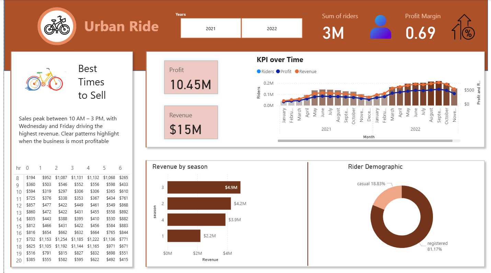

# Bike Rental Analysis Dashboard

## Dashboard Preview

## Project Overview
Analysis of hourly bike rental data for multiple years using SQL and Power BI. The project calculates revenue and profit and visualizes ridership trends.

## Workflow
1. CSV datasets loaded into SQL Server (SSMS).  
2. SQL queries written to combine yearly data and calculate revenue and profit (`sql/queries.sql`).  
3. Power BI dashboard created to explore trends and financial metrics.

